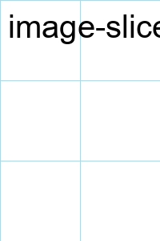
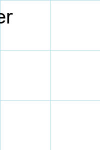
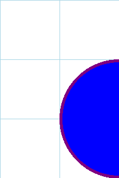
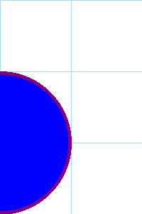
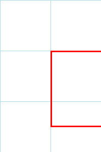
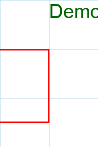
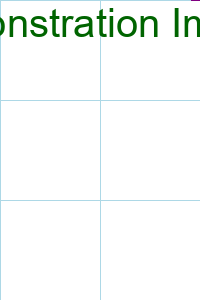
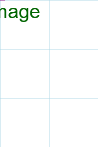

# How to Slice an Image into a Specific Number of Tiles

If you have a target number of tiles in mind, but you don't want to calculate the grid dimensions yourself, you can use the `--number-of-tiles` option.

## The `--number-of-tiles` Option

Instead of `--grid`, you can provide `--number-of-tiles` (or `-n`) with an integer value. `image-slicer` will then find the best grid layout to create that many tiles.

**Note:** The number of tiles must have factors other than 1 and itself. For example, you can't create a grid of 7 tiles.

## Example

Let's slice our source image into 8 tiles.

```bash
imslice docs/assets/source.png docs/assets/8_tiles --number-of-tiles 8
```

`image-slicer` will determine that an 8-tile grid is best arranged as 4 columns and 2 rows.

## The Result

Here are the 8 tiles produced by the command:

<table>
  <tr>
    <td></td>
    <td></td>
    <td></td>
    <td></td>
  </tr>
  <tr>
    <td></td>
    <td></td>
    <td></td>
    <td></td>
  </tr>
</table>
