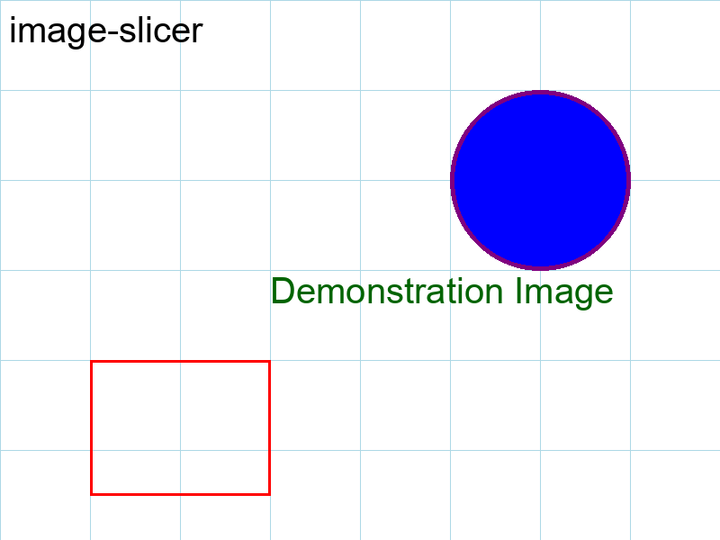

# Slicing Your First Image

This tutorial will walk you through the basics of using `image-slicer` from the command line to slice an image into a grid of tiles.

## 1. The Source Image

First, let's take a look at the image we'll be slicing. We've created a simple 800x600 pixel PNG file for this demonstration.



## 2. Slicing into a Grid

The most common way to slice an image is to define a grid of columns and rows. Let's slice our source image into a 3x2 grid (3 columns and 2 rows).

Open your terminal and run the following command:

```bash
imslice docs/assets/source.png docs/assets/grid_3x2 --grid 3 2
```

- `docs/assets/source.png`: The path to our source image.
- `docs/assets/grid_3x2`: The directory where the sliced tiles will be saved.
- `--grid 3 2`: Specifies that we want to slice the image into 3 columns and 2 rows.

## 3. The Result

After running the command, the `docs/assets/grid_3x2` directory will contain 6 tiles. Here's how they look when stitched back together:

<table>
  <tr>
    <td></td>
    <td></td>
    <td></td>
  </tr>
  <tr>
    <td></td>
    <td></td>
    <td></td>
  </tr>
</table>

That's it! You've successfully sliced your first image. In the next tutorials, we'll explore other slicing methods and options.
